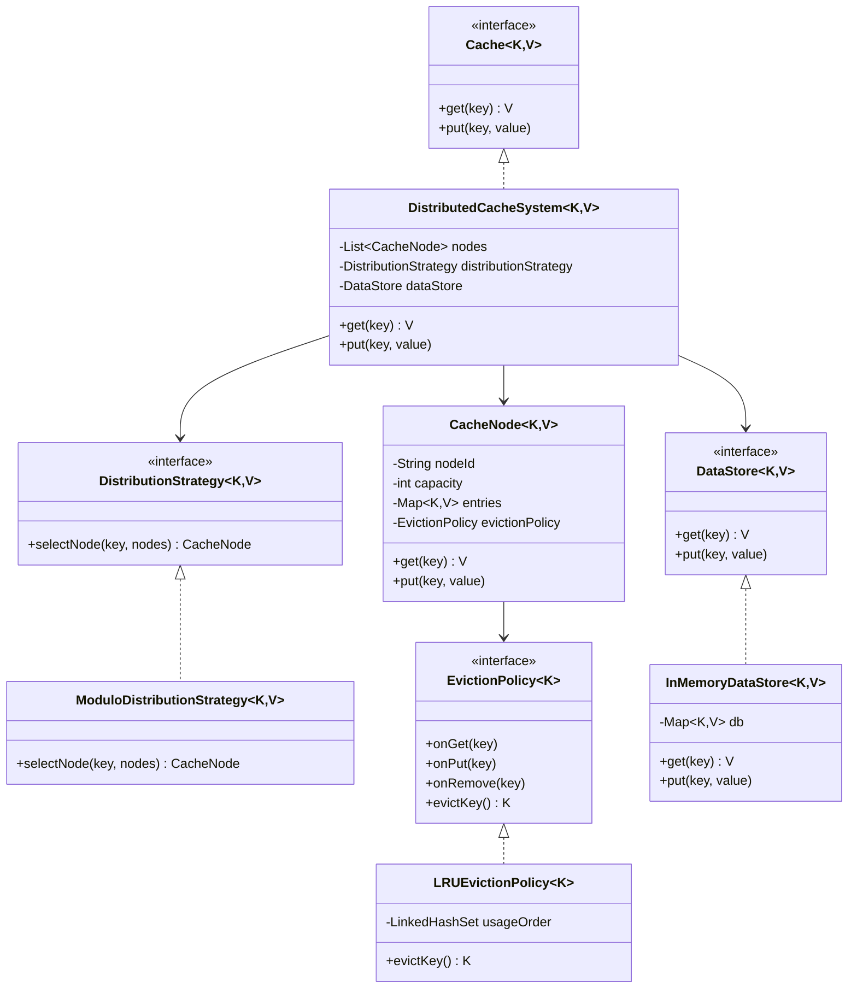

# Distributed Cache Design

## Class Diagram

## Design Explanation

- Data distribution across nodes:
  - `DistributedCacheSystem` delegates node selection to `DistributionStrategy`.
  - Current implementation uses `ModuloDistributionStrategy`: `index = floorMod(hash(key), nodeCount)`.
  - To support consistent hashing later, add `ConsistentHashDistributionStrategy` implementing `DistributionStrategy`.

- Cache miss flow (`get`):
  - Pick target node using distribution strategy.
  - If key exists in node, return directly (cache hit).
  - If absent, fetch from `DataStore`, write into selected node, return fetched value.

- Eviction behavior:
  - Every `CacheNode` has fixed capacity and pluggable `EvictionPolicy`.
  - Current `LRUEvictionPolicy` tracks recency using ordered set semantics.
  - On insert when full, node asks policy for `evictKey()` and removes that key.

- Write behavior (`put`):
  - Assumption used: **write-through**.
  - `put(key, value)` updates `DataStore` first, then updates cache node.

- Extensibility:
  - Distribution is strategy-based (`DistributionStrategy`).
  - Eviction is strategy-based (`EvictionPolicy`).
  - Storage backend is abstracted (`DataStore`).
  - Node internals are isolated in `CacheNode`.
