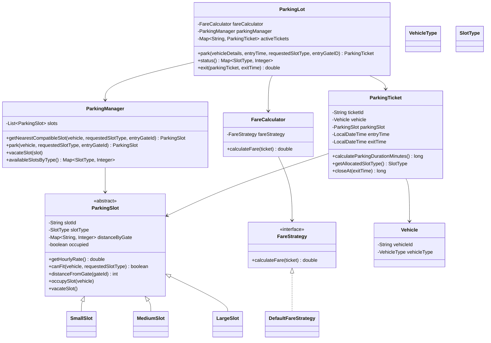

# Parking Lot Management System Design

## Class Diagram

## Design and Approach

- Single Responsibility Principle:
  - ParkingLot coordinates APIs and ticket lifecycle only.
  - ParkingManager handles slot search/allocation/release.
  - FareCalculator and FareStrategy handle billing.
  - ParkingSlot classes encapsulate slot type + gate distance behavior.
- Open/Closed Principle:
  - New fare rules can be added via FareStrategy implementations.
  - New slot types can be introduced via ParkingSlot extensions.
- Liskov Substitution Principle:
  - SmallSlot, MediumSlot, and LargeSlot are interchangeable as ParkingSlot.
- Interface Segregation Principle:
  - FareStrategy is a focused interface for pricing behavior.
- Dependency Inversion Principle:
  - FareCalculator depends on FareStrategy abstraction, not concrete implementation.

## Requirement Mapping

- Three slot types with different hourly rates: implemented by SmallSlot/MediumSlot/LargeSlot.
- Ticket contains vehicle details, allocated slot number/type, and entry time: ParkingTicket.
- Nearest compatible slot by entry gate: ParkingManager.getNearestCompatibleSlot.
- Vehicle-to-slot compatibility with larger-slot fallback: ParkingSlot.canFit + VehicleType.minimumRequiredSlotType.
- Billing based on allocated slot type rate: DefaultFareStrategy using ticket parking slot rate.
- APIs:
  - park(vehicleDetails, entryTime, requestedSlotType, entryGateID)
  - status()
  - exit(parkingTicket, exitTime)
