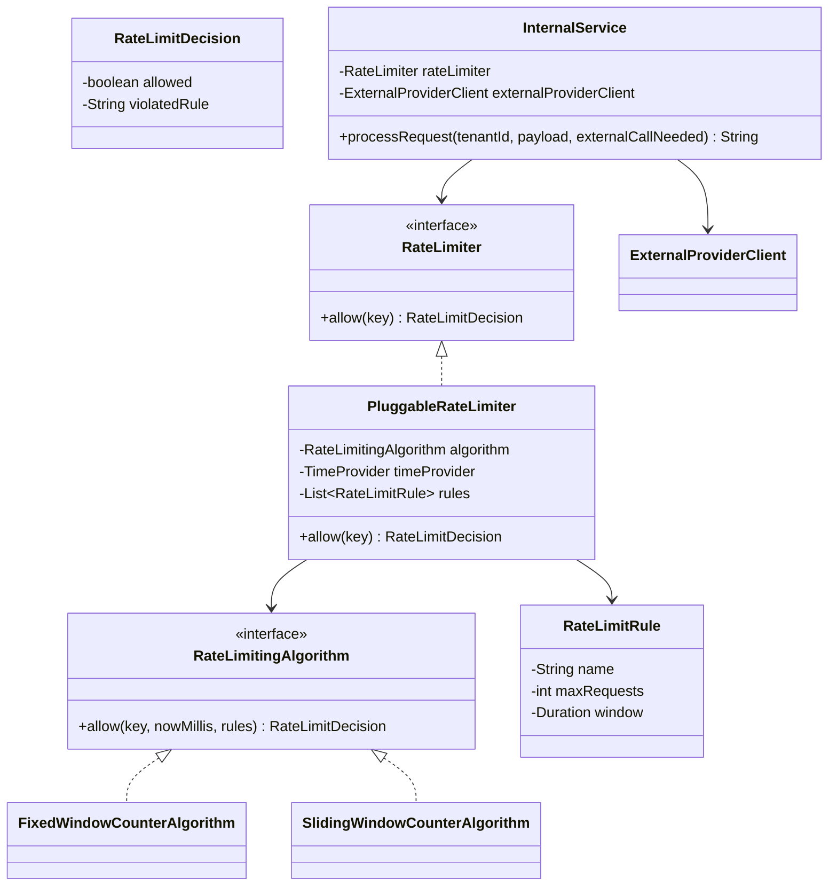

# Rate Limiter Design

## Class Diagram

## Key Design Decisions

- Rate limiting happens only before external resource usage:
  - `InternalService` runs business logic first.
  - If external call is not needed, limiter is not consulted.
- Algorithm pluggability:
  - `RateLimitingAlgorithm` strategy allows swapping fixed/sliding/token bucket in future without business logic changes.
- Rule extensibility:
  - Multiple `RateLimitRule` objects can be applied together (for example, per minute and per hour).
- Thread safety:
  - Shared states are in `ConcurrentHashMap`.
  - Per-key synchronization ensures atomic check-and-increment across all configured rules.
- Testability:
  - `TimeProvider` abstraction allows deterministic tests by injecting fake time.

## How It Works

- Data keying:
  - Caller passes a key (tenant, customer, API key, or provider).
- Fixed Window Counter:
  - Counts requests in aligned windows (`[00:00-00:59]`, `[01:00-01:59]`, etc).
  - Simple and fast, but has boundary burst problem.
- Sliding Window Counter:
  - Maintains current and previous window counts.
  - Uses weighted carry-over from previous window for smoother limiting.

## Trade-offs

- Fixed Window Counter:
  - Pros: simplest, low memory, high throughput.
  - Cons: abrupt resets allow bursts near window boundaries.
- Sliding Window Counter:
  - Pros: smoother, fairer across boundaries.
  - Cons: slightly more computation and state than fixed window.

## Assumption

- If an external call is denied, caller handles fallback gracefully (`rate-limited(...)` in demo).
